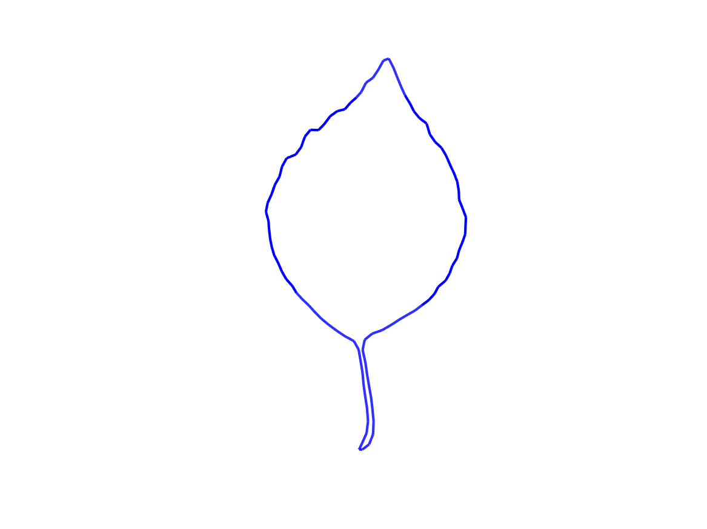
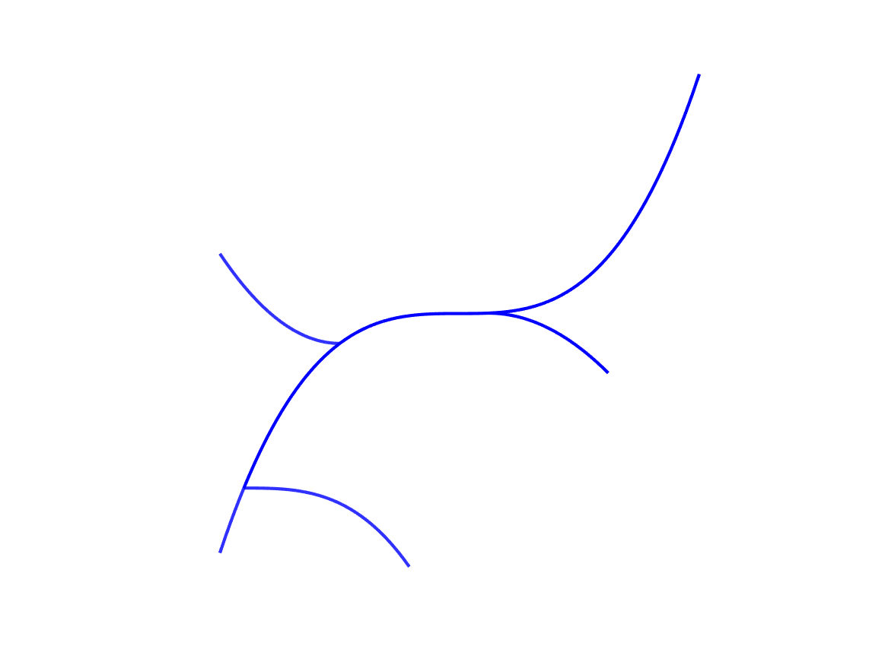

# ShapeGraph_H2match

This repository houses code for performing relaxed weighted shape graph matching with second order Sobolev metrics, which allows one to compute elastic distances and geodesics between shape graphs of any underlying topology.

## References

The code is a MATLAB implementation of the numerical optimization scheme proposed in [A new variational model for the analysis of shape graphs with partial matching constraints](https://arxiv.org/abs/2105.00678) by Yashil Sukurdeep, Martin Bauer and Nicolas Charon. For details, we refer to our paper:

```
    @misc{sukurdeep2021new,
      title={A new variational model for the analysis of shape graphs with partial matching constraints}, 
      author={Yashil Sukurdeep and Martin Bauer and Nicolas Charon},
      year={2021},
      eprint={2105.00678},
      archivePrefix={arXiv},
      primaryClass={math.OC}
}
```

Please cite our paper in your work.

## Dependencies

The code was tested on MATLAB R2020b. The following MATLAB Toolbox is required:

* MATLAB Bioinformatics Toolbox

The code incorporates the following libraries:

* h2metrics (https://github.com/h2metrics/h2metrics)
* fshapesTk (https://github.com/fshapes/fshapesTk)
* Hanso (https://cs.nyu.edu/overton/software/hanso/)

All relevant source code from these libraries are already included in this repository.


## Usage

To use this code, proceed as follows:

- Load (or define) the `source` and `target` shape graph structures.
- Select parameters for:
	- The relaxed matching objective function by defining the `objfun` structure.
	- The optimization procedure by defining the `optim` structure.
- Run the matching using the `shapegraph_h2match` function.
	- An example call looks like:
```Matlab
[optPath, transfSource, transfTarget, updatedSource, summary] = shapegraph_h2match(source, target, 'objfun', objfun, 'optim', optim);
```
- Visualize the results from the matching process using the `shapegraph_h2match_viewresult` function.

See the demo files in the "demo" folder for extensive details about the procedure outlined above. 

### Examples

The demo scripts also illustrate our code's ability to perform shape registration with partial matching constraints and topological inconsistencies.

- `demo_leaves.m` registers two Swedish leaves with partial matching constraints.
<p align="center">
  
</p>

- `demo_branches.m` registers two synthetic shape graphs with inconsistent topologies.
<p align="center">
  
</p>


## Licence
This program is free software: you can redistribute it and/or modify it under the terms of the GNU General Public License as published by the Free Software Foundation, either version 3 of the License, or (at your option) any later version.

This program is distributed in the hope that it will be useful, but WITHOUT ANY WARRANTY; without even the implied warranty of MERCHANTABILITY or FITNESS FOR A PARTICULAR PURPOSE. See the GNU General Public License for more details.

You should have received a copy of the GNU General Public License along with this program. If not, see http://www.gnu.org/licenses/.

## Contact Information
* Yashil Sukurdeep (yashil.sukurdeep@jhu.edu)
* Martin Bauer (bauer@math.fsu.edu)
* Nicolas Charon (charon@cis.jhu.edu)